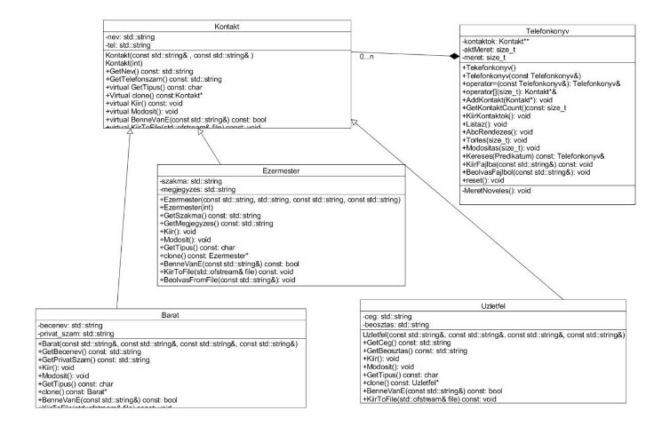

**HÁZI FELADAT**     Programozás alapjai 2. Végleges 

Kurely Mózes 

F0QEL1       2023. május. 28. 

**TARTALOM** 

1. [Feladat ................................................................................................................................. 2](#_page1_x68.00_y28.92)
1. [Feladatspecifikáció ............................................................................................................. 2](#_page1_x68.00_y55.92)
1. [Pontosított feladatspecifikáció ............................................................................................... 3](#_page1_x68.00_y28.92)
1. [Megvalósítás ....................................................................................................................... 4 ](#_page1_x68.00_y55.92)
1. [Osztályok funkciói .............................................................................................................. 5 ](#_page1_x68.00_y55.92)
1. [Main és bemenetek ............................................................................................................. 6 ](#_page1_x68.00_y55.92)

1. **Feladat** 

**1.1 Telefonkönyv 

Tervezze meg egy telefonkönyv alkalmazás egyszerűsített objektummodelljét, majd valósítsa azt meg! A telefonkönyvben kezdetben az alábbi adatokat akarjuk tárolni, de később bővíteni akarunk: 

- Név (vezetéknév, keresztnév)
- becenév 
- cím 
- munkahelyi szám 
- privát szám 

Az alkalmazással minimum a következő műveleteket kívánjuk elvégezni: 

- adatok felvétele
- adatok törlése 
- listázás 

A rendszer lehet bővebb funkcionalitású (pl. módosítás, keresés), ezért nagyon fontos, hogy jól határozza meg az objektumokat és azok felelősségét. Demonstrálja a működést külön modulként fordított tesztprogrammal!

2. **Feladatspecifikáció** 

A **Telefonkönyv** osztálynak aktMéret attribútuma lesz ami azt fogja megadni, hogy hány kontakt tartozik hozzá,  illetve maguk a kontaktok egy tárolóban, valamint a dinamikusan nővő méret attribútuma határozza meg az éppen maximális kontaktok számát. 

A telefonkönyvben létre lehet hozni kontaktot már egy névvel és egy telefonszámmal. 

A **Kontakt** lesz az ős osztály. Ebből fog leszármazni a **Barát** akinek lesz beceneve, privát száma. Illetve az  **Üzletfél**  akinek cég attribútuma és beosztása lesz. Továbbá ha szakmai segítséget  szeretnénk  akkor  nem  árt  ha  a  tudjuk  külön  elmenteni  a  mesteremberek telefonszámát. Amiben az **Ezermester** leszármazott osztály illetve az ahhoz tartozó szakma attribútum fog segíteni. A kontárok elkerülése végett, hozzájuk lehet rövid megjegyzést is írni, hogy el ne felejtkezzünk negatív(esetleg pozitív) tapasztalatainkról. 

*Keresés:*  

` `Lehet  keresni  tetszőleges  szöveg  alapján.  Ha  megtalálható  a  kontakt  valamelyik attribútumában  az  a  szövegrész  akkor  kilistázza  azt.  Továbbá  generikus  keresés  is megvalósítható, mellyel tetszőleges szempont szerint lehet keresni a telefonkönyv elemeire.  pl.: barátok listázása 

*Létrehozás:*  

Először is ki kell választanunk, hogy milyen kontaktok szeretnénk létrehozni. Majd az ott megjelenő attribútumok megadása után tudjuk menteni a személy adatait. 

*Módosítás:* 

Ki tudunk jelölni kontaktot a sorszáma alapján módosításra. Ekkor tudjuk majd módosítani. 

A  telefonkönyvet  lehet  másolni  illetve  be  lehet  olvasni  fájlból,  illetve  módosítás  után mentésre is kerül txt-be. ![ref1]

3. **Pontosított feladatspecifikáció** 

A  telefonkönyv  program  felhasználói  felülete  egy  telefonon  lévő  telefonkönyvet  fog modellezni. 

Az alábbi menüpontok lesznek:  

1, Keresés 

2, Új kontakt hozzáadása 

3, Kontaktok listázása 

4, Meglévő kontakt módosítása

5, Törles 

**1, Keresés:** Tetszőleges szöveg megadása után kilistázza azokat a kontaktokat amelyeknek bármelyik attribútuma tartalmazza az adott szöveget. 

**2, Új kontakt hozzáadása:** A kontakt típusának kiválasztása után megadhatóak a megfelelő attribútumok, és menteni lehet a kontaktot.  

**3, Kontaktok listázása:** Ki lehet választani hogy milyen kontaktokat jelenítsünk meg.  

   A, mindet 

    B, csak a barát típusú kontaktokat 

    U, csak az Üzletfél típusú kontaktokat 

    E, csak az Ezermester típusú kontaktokat 

**4, Meglévő kontakt módosítása.** Megjelenik minden kontaktnak csak a neve. Ez alapján kiválasztunk egy kontaktot a sorszáma szerint. Megjelenítjük az aktuális adatait. Majd alatta megadhatjuk azok új értékeit. 

**5, Törlés:** D menüponthoz hasonlóan kiválasztunk egy kontaktot a sorszáma alapjának és eltávolítjuk azt a Kontaktok közül.  

A menüben bizonyos karakterekkel tudunk navigálni. Vissza is léphetünk a főmenübe.  ![ref1]

4. **Megvalósítás**

**UML:** 

A  Telefonkönyvet  a  már  félkövére  jelzett  osztályokkal,  és  az  aláhúzással  jelzett attribútumokkal fogom megvalósítani: 

Ezeken kívül szükség lesz még a Menu osztályra illetve Predikátum osztályokra a Generikus keresés megvalósításához.:

**Tárolás** 

A telefonkönyvet txt-ben tároljuk illetve onnan be tudjuk olvasni. Ennek sorai a következő képpen fognak felépülni: 

**kontakt típusát azonosító id; az ősosztályt azonosító id; kontakt\_neve; telefonszáma; kontakt típusának megfelelő további adattagok.** 

példa1: egy barát kontaktot tartalmazó sor: B;K;Nagy János;06305608551;06701689548;Jancsi; 

példa2: egy üzletfelet tartalmazó sor: 

U;K;Kovács István;065012347895;MAV;vonatkerék pumpáló; 

5. **Osztályok funkciói**

**Minden osztály minden függvényének leírása megtalálható a programfájlokban.** 

**Kontakt:** 

Olyan ős osztály melyben nevet es telefonszámot lehet tarolni.** 

**Barát:** 

A Kontakt osztály leszármazott osztálya. Ugyan úgy van neve es telefonszáma de e mellett van beceneve es privát telefonszáma. 

**Ezermester:** 

A Kontakt osztály leszármazott osztálya. Ugyan úgy van neve es telefonszáma de e mellett van szakma es megjegyzés attribútuma. 

**Üzletfél:** 

A Kontakt osztály leszármazott osztálya. Ugyan úgy van neve es telefonszáma de e mellett van cég es beosztás attribútuma. 

**Telefonkönyv:** 

Kontaktokra mutató pointereket taroló Telefonkönyv osztály. Van egy tárolója: kontaktok, maximális mérete: meret és egy aktuális méretét nyilvántartó attribútuma: aktMeret. 

**Menü:** 

Menü  osztály  a  telefonkönyv  alkalmazás  irányításához.  Van  egy  állapota  ami  azt  tartja nyilván, hogy az alkalmazás menüje éppen milyen állapotban van: allapot.  

Predikátum osztályok: 

Ezeknek az osztályoknak a segítségével valósítható meg generikus keresés. 

- **BenneVanE**: 

`    `predikátum osztály arra hogy a kontakt tartalmazza-e az adott szót. 

- **UzletfelE**: 

`    `predikátum osztály arra, hogy üzletfél-e az adott kontakt. 

- **EzermesterE**: 

`    `predikátum osztály arra, hogy ezermester-e az adott kontakt. 

- **BaratE**: 

`    `predikátum osztály arra, hogy ezermester-e az adott kontakt. 

6. **Main és bemenetek** 

A  feltöltött  main  fájl  valósítja  meg  a  Telefonkönyv  alkalmazást  az  előbbi  osztályok segítségével.  

A megadott példa bemenetek az alkalmazás álltalános működését szimulálják, úgy, hogy az az alkalmazás minden részletét tesztelje.
