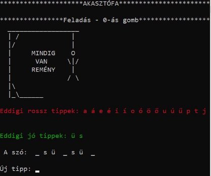
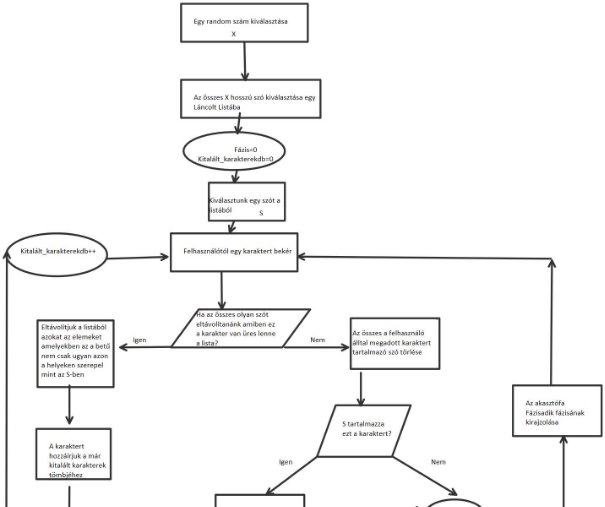

**KURELY MÓZES F0QEL1** 

**Specifikáció** 

**Felhasználói Dokumentáció Programozói Dokumentáció** 

**Specifikáció           Kurely Mózes – F0QEL1 Gonosz akasztófa** 

**A program célja:** 

Az akasztófa nevű ismert játék megvalósítása, ahol a számítógép ellen játszik a felhasználó. 

**A játék rövid leírása:** 

Ez  egy  kétszemélyes  játék,  ahol  az  egyik  játékos  (jelen  esetben  a számítógép) kiválaszt egy létező magyar szót, és a második játékosnak (továbbiakban felhasználó) ezt betűnkként kell kitalálnia. 

A „gonosz” rész abban rejlik, hogy a számítógép nem kötelezi el magát egyetlen szónál, a felhasználó tippjei alapján addig szűkíti a lehetséges megoldások halmazát, amíg már csak egyetlen szó lehet a kitalálandó szó.  

**A program részletes leírása:** 

A  programot  elindítva  a  főmenü  jelenik  meg  a  képernyőn,  ahol  3 menüpont látható, amik közül az alattuk lévő számmal tudunk választani, ezek a következők: 

- **Új Játék**  
1. Ezt  kiválasztva  egy  random  4  és  10  közötti  számot  fog kiválasztani a program és megjelenik a képernyőn ugyan annyi ’\_’ karakter, ami a kitalálandó szó karakterszámát szimbolizálja.  
1. Ezután a felhasználó egyesével tud megadni tippeket, amik kizárólag a magyar abc kisbetűs karakterei lehetnek. 
1. Ha rossz tippet adott meg a felhasználó akkor az akasztófa elkezd  felépülni,  majd  a  betű  megjelenik  a  konzolon,  mint hibás tipp. 
1. Ha helyesen tippel a felhasználó akkor az akasztófa változatlan marad, a karakter megjelenik helyes tippként a konzolon, és a betű helyén, ahol eddig  ’\_’ volt ez után a betű lesz látható. 
1. Az  akasztófa  ugyan  12  lépésből  épül  fel,  de  a  felhasználó akárhányszor tippelhet, a 12.tipp után az akasztófa állapota nem változik. 
1. A játék akkor ér véget ha a felhasználó a szó összes betűjét kitalálta, vagy feladja a játékot. 
7. Amennyiben nem feladással ért véget a játék úgy megjelenik a konzolon  az  elért pontszám. Ezt lehetősége van  menteni a felhasználónak  a  nevével  együtt  ami  nem  tartalmazhat szóközt.   
- **Dicsőség Tábla:** 

Itt jelenik meg az addigi lejobb 5 játékos, és pontszámuk, ami a következő  képlettet  számolandó:  (11-k)\*h-r+10  ahol  k:  a kitalálandó  szó  karaktereinek  száma,  h:  a  helyesen  eltalált karakterek száma, r: a helytelenül eltalált karakterek száma.  Az  előző  adatok  a  korábban  említett  dicsoseg\_tabla.txt-ből töltődnek be.  

Innen vissza tud lépni a felhasználó a Főmenübe. 

- **Játék Vége:** 

Ezzel tudja szabályosan bezárni a felhasználó a programot. 

**Felhasználói Dokumentáció Kurely Mózes – F0QEL1      Gonosz akasztófa** 

**Vezérlés:** 

A játék főbb menüpontjai közül az alattuk/felettük lévő szám beírásával + enter megnyomásával lehet választani. 

Az egyes részeknél csak az ott megjelenített menüpontok közül lehet választani. 

 

**Új Játék:** 

Az 1-es menüpontot kiválasztva új játék kezdődik. Ekkor a program tippeket vár. Tippnek a magyar abc karaktereinek kisbetűs verziója adható meg. Maximum 100 új tipp adható meg. 

Szabályos:    Szabálytalan: 

**Az Új játék bemutatása **Az akasztófa állapota 

Rossz tippek Helyes tippek A kitalálandó szó 

A játék feladásához Új tippnek a ’0’ karaktert szükséges megadni: 

 Megfejtés 

Amennyiben az összes karakter ki lett találva, lehetőség van a pontszám, illetve név mentésére. Ezzel a lehetőséggel az ’i’ vagy a ’I’ betűk megadásával lehet élni, a ’n’ vagy a ’N’ betűk megadásával lehet nem élni.  

Példa:  

Megfejtés Elért pontszám 

A mentett név nem tartalmazhat szóközt, illetve maximum 50 karakter hosszú lehet és csak a magyar abc karaktereit tartalmazhatja. 

Szabályos:    Szabálytalan:  

**Dicsőség Lista:** 

A dicsőség lista a legjobb 5 mentett eredményt jeleníti meg csökkenő sorrendben. 

**Játék Vége** 

A program szabályos bezárásához a Játék Vége menüpont használható. Ami a Menüben a 0-s billentyűvel érhető el.  

**Programozói Dokumentáció** 

**Kurely Mózes – F0QEL1**

Itt a fontosabb függvények leírása, funkciója található, részletes leírás kommentként a programban.

A programban 5 modul található: 

- main.c 
- megjelenites.c 
- jatek.c 
- szotar\_kezeles.c 
- dicsoseglista.c 

**Dicsoseglista.c** 

Ez tartalmaz egy struktúrát, ami a dicsőség lista egy tagját takarja az ezekből felépített láncolt listában. Ebben szerepel a név, a pontszám, illetve a következő elemre mutató pointer. 

A  listát  a  *DicsLista\*  dicsbeolvasas(void)*   függvény  olvassa  be  a  dicsoseg\_lista.txt  fájlból, visszatérési értéke a lista első elemére mutató pointer. Ha nem található a fájl akkor NULL pointert ad vissza. 

Mivel a dicsőségtáblán a legjobb 5 eredményt kell megjeleníteni ezért a szövegfájlban található adatokat rendezve szúrjuk be a listába. Ehhez a *DicsLista \*beszur(DicsLista \*elso,char  \*ujnev, int ujpont)*  függvényt használom, melynek visszatérési érteke az új elemmel bővített lista első elemére mutató pointer. 

A  már  említett  kiíratást  a  void  dicslistakiiratas(DicsLista  \*eleje)  függvény  végzi  mely  a paraméterként a dicsőséglista első elemére mutató pointert várja, és kiírja a lista első 5 elemét a konzolra. 

A dicsőséglistát fel is kell szabadítani mivel dinamikusan tároltuk a lista elemeit. A felszabadítást a void dicslista\_free(DicsLista \*eleje)   függvény végzi 

Ezen kívül itt található még az int eredmenymentes(char nev[50],int pontszam) függvény amely a paraméterként kapott szót és számot beírja a dicsoseg\_lista.txt-be-új sorba, 1-et ad vissza ha ez lehetséges volt, 0-t ha nem. 

**szotar\_kezeles.c** 

Ez a modul is tartalmaz egy struktúrát, ami a szavak.txt (amiben közel az összes magyar szó megtalálható)  szavainak  eltárolásához  kell.  A  szavakat  láncolt  listában  tárolom.  Ezért  a  struktúra tartalmaz egy a szóra mutató pointert, a szó hosszát egész számként, és a lista következő elemére mutató pointert.  

A szavak beolvasásához a  SzoLista\* beolvasas(void) függvény szükséges. ahol dinamikusan eltárolom a txt-ből beolvasott szót, majd hozzáfűzőm azt listához a void lista\_elejere\_beszur(SzoLista \*\*eleje,char  \*ujszo) függvény segítségével. 

A játék során szükségünk lesz olyan funkcióra hogy ki tudjuk választani a lista egy random elemét, ezt a char\* random\_szo\_listabol(SzoLista \* eleje) függvény teljesíti Hiszen a függvény egy lista elejere mutató pointert var és visszatérési érteke pedig egy pointer ami a lista egy véletlenszerűen kiválasztott elemének szavára mutat. 

A void eltavolitas\_karakter\_alapjan(SzoLista \*\*eleje, char s) függvény eltávolítja a láncolt listából azokat az elemeket amelyek szava tartalmazza a paraméterként megadott karaktert.  

A SzoLista \* random\_hosszu\_szavak\_select(SzoLista \* eredeti) függvény paraméterként veszi át az összes magyar szót tartalmazó lista első elemére mutató pointert, visszatérési értéke pedig egy másik lista első elemére mutató pointer amiben benne van az összes véletlenszerűen kiválasztott hosszúságú szó. 

A  bool  torolhetoe(SzoLista  \*eleje,  char  s)  függvény  megmondja  hogy  ha  a  paraméterként átadott  lista  összes  olyan  elemét  kitörölnénk  ami  tartalmazza  a  szintén  paraméterként  átadott karaktert, akkor üres listánk maradna e. 

A  void  eltavolitas\_karakterhely\_alapjan(SzoLista  \*\*eleje,  int  T[10],char  k)  függvény  a paraméterként  kapott  lista  elemei  kozul  kitorli  azokat  amelyek  nem  csak  ugyan  azon  a  helyen tartalmazzak a megadott karaktert mint a szinten paraméterként kapott számtömben az 1-esek vannak. 

**jatek.c** 

Ez a modul csupán egy játékmenet lebonyolítását végzi. 

Legfontosabb függvény-e a void ujjatek(SzoLista \*eleje) amelyben ténylegesen lejátszódnak a játék  mögötti  folyamatok,  ennek  a  folyamatábrája  látható  itt.  A  programban  ez  is  részletesen kommentelve van.  

**megjelenites.c** 

Ebben  a  modulban  olyan  függvény-ek  találhatóak,  amik  a  háttérben  menő  folyamatoknak biztosítják, hogy megjelenjenek a konzolon, a felhasználónak érthető formában. 

**main.c** 

Ez a program alapja, innen hívjuk meg a főbb függvényeket. 
